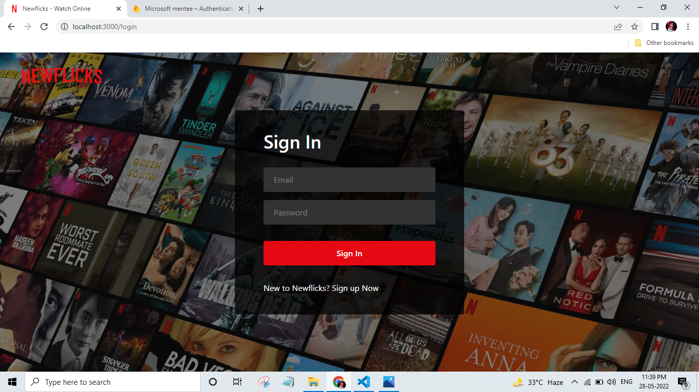

Check out our [Next.js deployment documentation](https://nextjs.org/docs/deployment) for more details.

# The Movie Recommender System

---

**Application url:** https://microsoft-streaming-services.vercel.app/

---

Recommender System is a system that seeks to predict or filter preferences according to the user's choices. Recommender systems are utilized in a variety of areas including movies, music, news, books, research articles, search queries, social tags, and products in general


## Architecture Screenshot


---

## Recommendation System

### Types of Recommender Systems

- Content-Based Movie Recommendation Systems
- Collaborative Filtering Movie Recommendation Systems

Get all the movie data in different categories from the TMDB database by making an AJAX call then based on the user history and watched time, find the nearest movie with combination of vote_average and popularity, get the first 20 movies and show in the top row with the Recommendation title.

### We have used the following:

- Filtering by using calculating euclidean distance to get the nearest matches.
- Content based filtering
- Filtering based on user watched history
- Recommendation based on movies added in watch list

Few Screenshot below to showcase the workflow:

- Filtering based on user watched history
  

  

---

## Apllication Screenshots 

- Filtering based on user watched history
  
  
  
  
  
  
  
  
  
  

## Apllication Screenshots on Laptop

- Filtering based on user watched history

## Fully responsive Website

- The website is fully responsive on the large, meduim and small screens like
  Laptop/Desktop, tablets and phones and feature changes as true netflix.

### Future scope

- Better recommendation system using collabrative and hybrid trained model by using ML.
- Locality based recommendation system
- Better code coverage to ensure & maintain the code quality.
- Add support for scalability.

---

### Tech Stack

- Nextjs (Reactjs framwork) with Typescript
- Authentication: Firebase Auth
- DB: Firebase database
- Backend API: TMDB Movie
- CI/CD: Vercel
- Testing: React testing liabrary & jest

---

### How to run in local

- In order to run this application in local you need the following:

  - Clone this repository and intall all the dependencies
    eg.
    `npm install or yarn i`

  - Get the API key from the TMDB app.
    - Create the file `.env.local` at the root level and add the `NEXT_PUBLIC_API_KEY=506********************7`
  - You will also have create the project in the firebase console then get the configuration and replace in the `firebase.ts`
  - Also create the Firestore database and make sure edit the rules to allow read & write.
  - If all set, run `npm run dev`
  - Open [http://localhost:3000](http://localhost:3000) with your browser to see the result.
  - You can start editing the page by modifying `pages/index.tsx`. The page auto-updates as you edit the file.

  First, run the development server:

```bash
npm run dev
# or
yarn dev
```

---

## Learn More

To learn more about Next.js, take a look at the following resources:

- [Next.js Documentation](https://nextjs.org/docs) - learn about Next.js features and API.
- [Learn Next.js](https://nextjs.org/learn) - an interactive Next.js tutorial.

You can check out [the Next.js GitHub repository](https://github.com/vercel/next.js/) - your feedback and contributions are welcome!

## Deploy on Vercel

The easiest way to deploy your Next.js app is to use the [Vercel Platform](https://vercel.com/new?utm_medium=default-template&filter=next.js&utm_source=create-next-app&utm_campaign=create-next-app-readme) from the creators of Next.js.

Check out our [Next.js deployment documentation](https://nextjs.org/docs/deployment) for more details.
